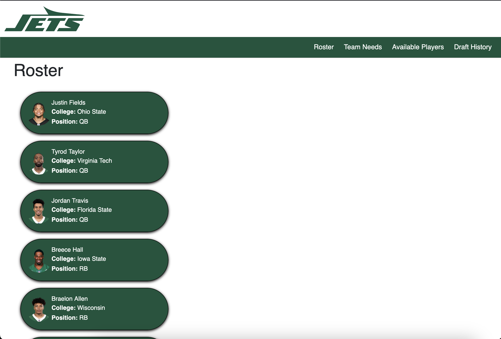
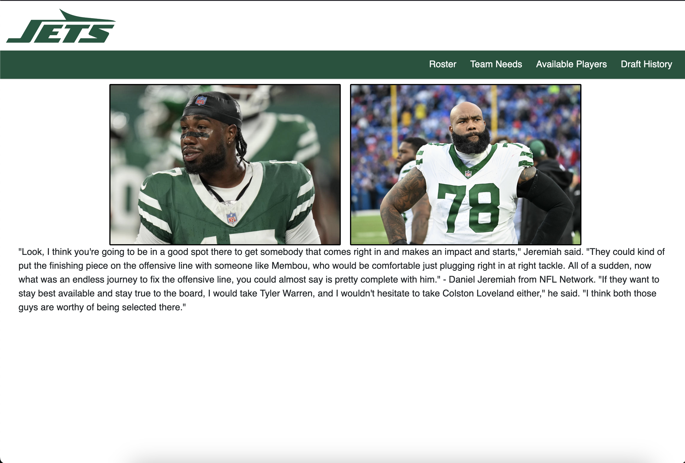
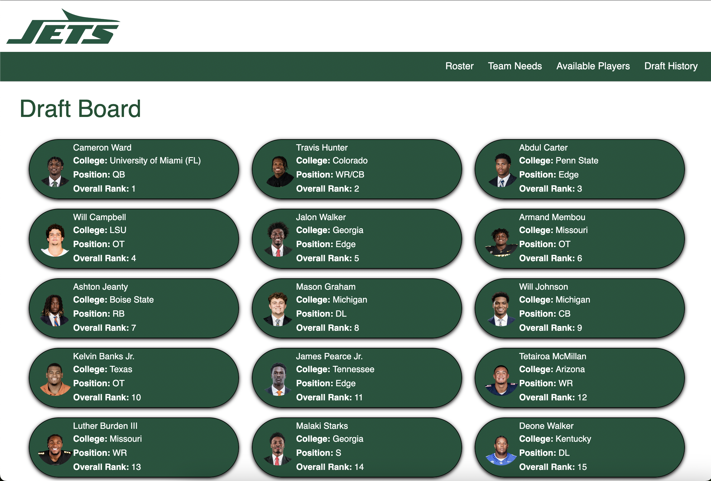

# New York Jets Fan Website 

FOR EDUCATIONAL PURPOSES ONLY! I do not make money off of this in any way. This is using the default razor template. I'm familiarizing myself with this environment. Thank you!
Welcome to the **New York Jets Fan Website**, your ultimate destination for everything related to the New York Jets! Whether you're looking for the latest team roster, analysis on the team's needs, available players, or a deep dive into the Jets' draft history, this website has it all.

## Features

This site is built using **C#** and **Razor Pages**, ensuring a seamless and dynamic experience for fans of the Jets. Here's a quick overview of what you'll find:

### 1. **Roster**
The current New York Jets roster is always up-to-date. You can explore the full roster, complete with player stats, positions, and other relevant details.

### 2. **Team Needs**
Check out the current team needs for the New York Jets, including positions that need improvement and potential areas the team might focus on in upcoming drafts or trades.

### 3. **Available Players**
Browse a list of free agents or players currently available in the market who might be potential fits for the Jets. Filter by position, experience, or other key stats to find the perfect addition to the team.

### 4. **Draft History**
Dive into the New York Jets' draft history! From past draft picks to detailed insights about each player and how they contributed (or not) to the team's performance, it's all here.

## Libraries and Languages used

- **C#**: The core programming language behind the site.
- **Razor Pages**: For rendering dynamic views and managing user requests.
- **ASP.NET Core**: Web framework for building modern, high-performance websites.
- **HTML/CSS/JavaScript**: For frontend display and interactivity.
